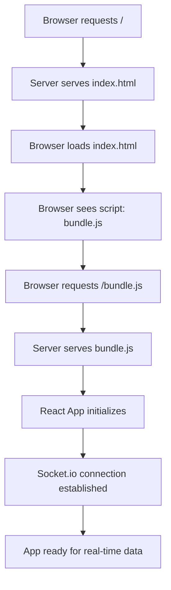

# Red Tetris - Architecture Documentation

## 🏗️ Overview

Red Tetris is a multiplayer networked Tetris game built with a **Single Page Application (SPA)** architecture using **Full Stack JavaScript**. The architecture follows a strict separation between client-side functional programming and server-side object-oriented programming.

## 📋 Table of Contents

- [Architecture Principles](#architecture-principles)
- [Technology Stack](#technology-stack)
- [Application Flow](#application-flow)
- [Client-Side Architecture](#client-side-architecture)
- [Server-Side Architecture](#server-side-architecture)
- [Communication Protocol](#communication-protocol)
- [File Structure](#file-structure)
- [Data Flow](#data-flow)
- [Testing Strategy](#testing-strategy)

## 🎯 Architecture Principles

### **Client-Side: Functional Programming**
- **NO "this" keyword** allowed (except for custom Error subclasses)
- **Pure functions** for all game logic
- **Immutable data structures**
- **React functional components** with hooks

### **Server-Side: Object-Oriented Programming**
- **Class-based architecture** using prototypes
- **Required classes**: Player, Game, Piece, Room
- **Event-driven** socket handling
- **Stateful** game management

## 🛠️ Technology Stack

### **Client (Browser)**
```javascript
- React 19.1.1          // UI Framework (functional components)
- Socket.io Client 4.8.1 // Real-time communication
- CSS Grid/Flexbox       // Layout (NO tables, canvas, SVG)
- Webpack 5.91.0         // Module bundler
- Babel                  // JavaScript transpilation
```

### **Server (Node.js)**
```javascript
- Node.js               // Runtime environment
- Express 5.1.0         // HTTP server
- Socket.io 4.7.5       // WebSocket communication
- ES6 Modules           // Module system
- CORS & Helmet         // Security middleware
```

### **Testing & Build**
```javascript
- Jest 29.7.0           // Testing framework
- Babel-Jest            // Test transpilation
- Webpack               // Client bundling
- Coverage reporting    // 70%+ statements, functions, lines; 50%+ branches
```

## 🔄 Application Flow

### **1. Initial Load Sequence**



### **2. File Serving (HTTP) - One Time Only**

**Initial Request:**
```http
GET / HTTP/1.1
Host: localhost:3004
```

**Server Response:**
```html
<!doctype html>
<html>
  <head>
    <title>RedTetris</title>
  </head>
  <body>
    <div id="tetris"></div>
    <script src="/bundle.js"></script>
  </body>
</html>
```

**Bundle Request:**
```http
GET /bundle.js HTTP/1.1
Host: localhost:3004
```

**Server Response:** Compiled React application (~1MB JavaScript bundle)

### **3. Real-Time Data Exchange (WebSocket) - Ongoing**

After initial load, **NO MORE HTML requests**. Only data via Socket.io:

```javascript
// Client → Server
socket.emit('join-room', { roomId: 'ROOM123', playerName: 'Alice' });
socket.emit('player-move', { playerId: '1', move: 'left' });

// Server → Client  
socket.emit('room-joined', { game: {...}, players: [...] });
socket.emit('game-started', { gameId: '1', firstPiece: {...} });
```

## 💻 Client-Side Architecture

### **Entry Point: src/client/index.js**
```javascript
import React from 'react';
import ReactDOM from 'react-dom';
import App from './containers/app.js';

// React takes control of the DOM
ReactDOM.render(<App />, document.getElementById('tetris'));
```

### **Component Structure**
```
src/client/
├── containers/
│   └── app.js              // Main application container
├── components/
│   ├── Board.js            // Game board rendering
│   ├── GameLobby.js        // Waiting room
│   ├── OpponentsList.js    // Multiplayer opponents
│   ├── Controls.js         // Game instructions
│   └── Modals/             // Join/Create room modals
├── hooks/
│   ├── useGameState.js     // Game state management
│   ├── useMultiplayerState.js // Multiplayer logic
│   └── useKeyboardControls.js // Input handling
├── utils/
│   ├── gameLogic.js        // Pure game functions
│   ├── gameHelpers.js      // URL parsing, validation
│   └── tetrominos.js       // Piece definitions
└── services/
    ├── socketService.js    // WebSocket client
    └── localStorageService.js // Persistence
```

### **Pure Game Logic Functions**
```javascript
// All game logic implemented as pure functions
export const createEmptyBoard = () => Array(20).fill().map(() => Array(10).fill(0));
export const rotatePiece = (piece, board) => { /* pure function */ };
export const checkCollision = (piece, board, x, y) => { /* pure function */ };
export const clearLines = (board) => { /* pure function */ };
export const addPenaltyLines = (board, count) => { /* pure function */ };
export const generateSpectrum = (board) => { /* pure function */ };
```

### **React Functional Components**
```javascript
// Example: No "this" keyword, only functional components
const GameBoard = ({ board, currentPiece, nextPiece }) => {
  const [gameState, setGameState] = useState(initialState);
  
  const handleMove = useCallback((direction) => {
    const newPiece = movePiece(currentPiece, direction, board);
    setGameState(prev => ({ ...prev, piece: newPiece }));
  }, [currentPiece, board]);
  
  return (
    <div className="game-board">
      <Board board={board} piece={currentPiece} />
      <NextPiecePreview piece={nextPiece} />
    </div>
  );
};
```

## 🖥️ Server-Side Architecture

### **Entry Point: src/server/main.js**
```javascript
import params from '../../params';
import * as server from './index';

server.create(params.server)
  .then(() => console.log('Tetris server ready...'));
```

### **Server Structure**
```
src/server/
├── index.js                // Express + Socket.io setup
├── main.js                 // Application entry point
├── socketHandlers.js       // Socket event handlers
├── models/
│   ├── Game.js            // Game class (OOP)
│   ├── Player.js          // Player class (OOP)
│   ├── Piece.js           // Piece class (OOP)
│   └── Room.js            // Room class (OOP)
└── utils/
    └── pieceGenerator.js   // Piece sequence generation
```

### **Object-Oriented Models**
```javascript
// Example: Player class using prototypes/classes
class Player {
  constructor(id, name, socketId) {
    this.id = id;
    this.name = name;
    this.socketId = socketId;
    this.gameId = null;
    this.board = Array(20).fill().map(() => Array(10).fill(0));
    this.spectrum = Array(10).fill(0);
    this.isLeader = false;
    this.isAlive = true;
  }
  
  updateBoard(newBoard) {
    this.board = newBoard;
    this.spectrum = generateSpectrum(newBoard);
  }
  
  setAsLeader() {
    this.isLeader = true;
  }
}
```

### **Express Server Setup**
```javascript
export function create(params) {
  const app = express();
  
  // Security middleware
  app.use(helmet());
  app.use(cors());
  
  // Static file serving (SPA)
  app.get('/', (req, res) => {
    res.sendFile(path.join(__dirname, '../../index.html'));
  });
  
  app.get('/bundle.js', (req, res) => {
    res.sendFile(path.join(__dirname, '../../build/bundle.js'));
  });
  
  // Socket.io server
  const server = http.createServer(app);
  const io = new SocketIO(server);
  
  registerSocketHandlers(io);
  
  return new Promise(resolve => {
    server.listen(params.port, params.host, () => resolve());
  });
}
```

## 🔌 Communication Protocol

### **Socket.io Events**

#### **Client → Server Events**
```javascript
// Room Management
socket.emit('join-room', { roomId: 'ROOM123', playerName: 'Alice' });
socket.emit('create-room', { roomId: 'ROOM123', playerName: 'Alice' });
socket.emit('start-game', { gameId: 'game-1' });

// Game Actions  
socket.emit('player-move', { playerId: '1', move: 'left'|'right'|'rotate'|'drop' });
socket.emit('piece-placed', { playerId: '1', piece: {...}, newBoard: [...] });
socket.emit('lines-cleared', { playerId: '1', linesCount: 2 });
socket.emit('game-over', { playerId: '1' });
```

#### **Server → Client Events**
```javascript
// Room Management
socket.emit('room-joined', { game: {...}, players: [...] });
socket.emit('room-created', { game: {...}, players: [...] });
socket.emit('game-started', { gameId: '1', firstPiece: {...} });
socket.emit('game-ended', { winner: {...} });

// Game Updates
socket.emit('next-piece', { piece: {...} });
socket.emit('player-board-updated', { playerId: '2', board: [...], spectrum: [...] });
socket.emit('penalty-lines', { playerId: '1', count: 2 });
socket.emit('player-disconnected', { playerId: '2' });

// Error Handling
socket.emit('join-error', { message: 'Room is full' });
socket.emit('game-error', { message: 'Invalid move' });
```

### **URL-Based Room System**
```javascript
// URL Format: #<room>[<player_name>]
// Examples:
// http://localhost:3004/#ROOM123[Alice]
// http://localhost:3004/#ABC123[Bob]

// Client-side URL parsing
const parseHashUrl = (hash) => {
  const match = hash.match(/^([A-Za-z0-9]+)(?:\[([^\]]+)\])?$/);
  return match ? { roomId: match[1], playerName: match[2] } : null;
};
```

## 🎮 Data Flow

### **Multiplayer Game Flow**

1. **Room Creation/Joining**
   ```javascript
   // URL: http://localhost:3004/#ROOM123[Alice]
   Client → parseHashUrl() → socket.emit('join-room')
   Server → Room.addPlayer() → socket.emit('room-joined')
   ```

2. **Game Start** (Leader only)
   ```javascript
   Client → socket.emit('start-game')
   Server → Game.start() → Generate piece sequence
   Server → Broadcast 'game-started' to all players
   ```

3. **Piece Movement**
   ```javascript
   Client → Keyboard input → Pure function validation
   Client → socket.emit('player-move')
   Server → Validate → Broadcast to all players
   ```

4. **Line Clearing & Penalties**
   ```javascript
   Client → clearLines() → socket.emit('lines-cleared', { count: 2 })
   Server → Calculate penalties (2-1=1 line)
   Server → Broadcast 'penalty-lines' to other players
   ```

5. **Game Over**
   ```javascript
   Client → Detect collision → socket.emit('game-over')
   Server → Check remaining players → Determine winner
   Server → Broadcast 'game-ended' with winner
   ```

## 📁 File Structure

```
red_tetris_boilerplate/
├── public/
│   └── index.html              // SPA entry point
├── src/
│   ├── client/                 // React application (functional)
│   │   ├── components/         // UI components
│   │   ├── containers/         // App container
│   │   ├── hooks/              // Custom React hooks
│   │   ├── services/           // Socket.io client, localStorage
│   │   ├── utils/              // Pure functions, game logic
│   │   └── styles/             // CSS modules
│   └── server/                 // Node.js server (OOP)
│       ├── models/             // Game, Player, Piece, Room classes
│       ├── utils/              // Server utilities
│       └── socketHandlers.js   // Socket event handlers
├── test/                       // Test suite (70%+ coverage)
├── build/                      // Webpack output
│   └── bundle.js              // Compiled React app
├── webpack.config.js          // Build configuration
├── package.json               // Dependencies & scripts
└── params.js                  // Server configuration
```

## 🧪 Testing Strategy

### **Coverage Requirements (Met)**
- **Statements**: 80.35% (Target: 70%) ✅
- **Functions**: 87.5% (Target: 70%) ✅  
- **Lines**: 80.73% (Target: 70%) ✅
- **Branches**: 67.97% (Target: 50%) ✅

### **Test Files**
```javascript
test/
├── gameHelpers.test.js         // URL parsing, validation (62 tests)
├── gameLogic.test.js          // Pure game functions (16 tests)
├── tetrominos.test.js         // Piece definitions (54 tests)
├── Room.test.js               // Server model tests (34 tests)
├── pieceGenerator.test.js     // Sequence generation (32 tests)
└── helpers/
    └── server.js              // Test utilities
```

### **Testing Focus**
- **Core Business Logic**: Pure functions, game mechanics
- **Server Models**: Room management, player operations  
- **Utility Functions**: URL parsing, piece generation
- **Strategic Exclusions**: UI components (require browser environment)

## 🚀 Build Process

### **Development Mode**
```bash
# Start server
npm run srv-dev    # Babel-watch with hot reload

# Start client build
npm run client-dev # Webpack dev server with HMR

# Run tests
npm test          # Jest test runner
npm run coverage  # Generate coverage report
```

### **Production Build**
```bash
# Build client bundle
npm run client-dist  # Webpack production build

# Build server
npm run srv-dist     # Babel compilation to dist/

# Start production server
node dist/server/main.js
```

## 🎯 Key Features

### **Multiplayer Mechanics**
- **Identical piece sequences** for all players in same game
- **Penalty system**: N lines cleared → N-1 penalty lines for opponents
- **Real-time spectrum** updates showing opponents' board heights
- **Leader controls** for game start/restart

### **Game Rules**
- **Board**: 10 columns × 20 rows
- **7 Tetromino types**: I, O, T, S, Z, J, L with rotation
- **Win condition**: Last player alive
- **Solo play**: Supported alongside multiplayer

### **Technical Constraints**
- **No jQuery, Canvas, SVG**: Pure React + CSS Grid/Flexbox
- **Functional client**: No "this" keyword (except Error subclasses)
- **OOP server**: Classes and prototypes required
- **Pure functions**: Game logic must be side-effect free

## 🔒 Security & Performance

### **Security Measures**
- **Helmet.js**: Security headers
- **CORS**: Cross-origin resource sharing
- **Input validation**: All socket events validated
- **No credentials**: Local .env files only

### **Performance Optimizations**
- **Bundle splitting**: Single bundle.js for now (can be optimized)
- **Socket.io**: Efficient WebSocket communication
- **React optimization**: useMemo, useCallback hooks
- **Pure functions**: Predictable, testable game logic

---

## 🎮 Usage Example

1. **Start the server**: `npm run srv-dev`
2. **Build the client**: `npm run client-dev`  
3. **Create a game**: Visit `http://localhost:3004/#ROOM123[Alice]`
4. **Join the game**: Another player visits `http://localhost:3004/#ROOM123[Bob]`
5. **Start playing**: Leader clicks "Start Game", pieces fall automatically
6. **Multiplayer action**: Clear lines to send penalties to opponents
7. **Win condition**: Last player standing wins!

This architecture provides a scalable, real-time multiplayer Tetris experience while maintaining strict separation between functional client code and object-oriented server code as required by the project specifications.
